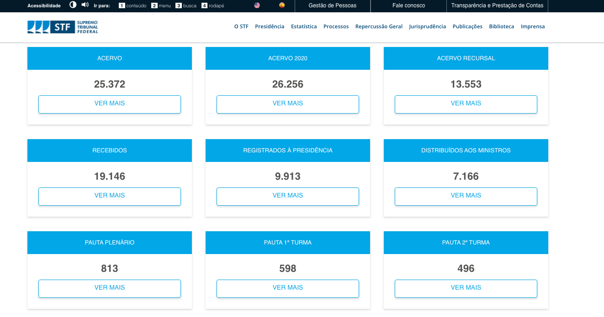

# Introdução

O STF vem passando por diversas mudanças com a transformação de seu parque tecnológico, inovação da era digital, gestão focada em evidências. A instituição do InovaSTF, que funcionará como um ambiente multidisciplinar fomentador de novas soluções de tecnologia na gestão processual, consolida essa visão de uma Corte Digital.

Atualmente, a gestão possui mais de 99% dos feitos tramitando eletronicamente. Avanços estes possíveis com a consolidação do STF Digital, plataforma que unifica todos os sistemas internos do Tribunal, suportando a automatização do processo judicial de forma flexível, centralizada e integrada. 

Também avançamos com o novo formato do Diário da Justiça Eletrônico, em versão HTML, automatizamos o fluxo processual desde a autuação até a baixa definitiva e instituímos uma nova disciplina para o processo eletrônico que privilegia a tramitação 100% digital.

Esse avanço se deu também com aproximação da sociedade através do fortalecimento da Central do Cidadão, o lançamento da Carta de Serviços, a criação do Painel Multissetorial de Checagem de Informações e Combate a Notícias Falsas.

A Corte avançou significativamente na Transparência de seus dados. Ainda em 2018, o Tribunal lançou Resolução 613/2018 que regulamenta a aplicação, no âmbito do Supremo Tribunal Federal, da Lei nº 12.527/2011, que versa sobre o acesso à informação. Os dados estão disponíveis no site:

```{r, echo=FALSE, out.width="110%",out.height="130%",fig.show='hold', fig.align='center'}


```

Ainda neste sentido, pensando na Transparência de dados judiciais, o portal da Estatística (http://portal.stf.jus.br/estatistica/) foi reformulado com o objetivo de trazer dados atualizados diariamente para seu jurisdicionado de maneira interativa, amigável e intuitiva.

```{r, echo=FALSE, out.width="110%",out.height="130%",fig.show='hold', fig.align='center'}


```

A página da estatística procura trazer os principais resultados de forma resumida numa primeira página e possibilita o detalhamento da informação utilizando o botão "VER MAIS".

```{r, echo=FALSE, out.width="110%",out.height="130%",fig.show='hold', fig.align='center'}


```

O documento a seguir tem como objetivo documentar a definição e critérios das principais estatísticas judiciais da Corte disponíveis no site e mostrar algumas funcionalidades.