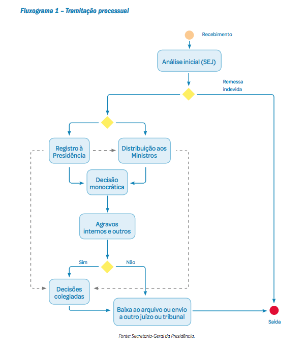

# <mark>Trâmite processual</mark> {#tramite}

O site da estatística foi pensado para o público geral. **A ideia é trazer transparência e possibilidade de consulta aos microdados de forma fácil e intuitiva**. Para isso, é interessante explicarmos um pouco mais detalhadamente a tramitação processual do STF de forma esquematizada. <mark>Retirar "Remessa devida da figura"</mark>

```{r echo=FALSE, out.width = '100%',dpi = 300}

```

Todo esse processo gera os dados que temos hoje no site do Supremo. De forma simplificada, podemos dividir a tramitação processual em 5 dimensões, como abaixo:

```{r echo=FALSE, out.width = '100%', dpi = 300}
knitr::include_graphics("imagens/fig-cap3-2.png")
```

Cada uma dessas dimensões está destrinchada em painéis específicos, podendo ser obtidas informações mais detalhadas de cada etapa.

## Classes processuais

As classes processuais estão previstas no art. 55 do Regimento Interno do Supremo Tribunal Federal (RISTF), com atualização da Resolução 604/2017 e são divididas entre recursais e originárias e . São classes recursais o recurso extraordinário (RE), o recurso extraordinário com agravo (ARE) e o agravo de instrumento (AI). São classes originárias todas as demais, incluídos os recursos ordinários.  Atualmente, as classes recursais estão submetidas ao regime da **repercussão geral**, criado pela [Emenda Constitucional n° 45/2004](http://www.planalto.gov.br/ccivil_03/Constituicao/Emendas/Emc/emc45.htm#art9) e regulamentado pelos arts. 1.035 e 1.036 do Novo Código de Processo Civil, na redação dada pela [Lei 13.256/2016](http://www.planalto.gov.br/ccivil_03/_Ato2015-2018/2016/Lei/L13256.htm#art3).

A [Resolução 604/2017](http://www.stf.jus.br/ARQUIVO/NORMA/RESOLUCAO604-2017.PDF) atualiza as classes processuais e os incidentes disponíveis para autuação e registro de processos no Supremo Tribunal Federal.

### Classes Processuais

```{r echo=FALSE}

cap3_1 <- readxl::read_excel("dados/cap3.xlsx", sheet = "classes_3-1")

cap3_1 |> 
kableExtra::kable()
```

### Incidentes apartados

```{r echo=FALSE}

cap3_2 <- readxl::read_excel("dados/cap3.xlsx", sheet = "classes_3-2")
cap3_2 |> 
kableExtra::kable()
```

### Incidentes processuais

```{r echo=FALSE}
cap3_3 <- readxl::read_excel("dados/cap3.xlsx", sheet = "classes_3-3")
cap3_3 |> 
kableExtra::kable()
```

### Recursos Internos

```{r echo=FALSE}
cap3_4 <- readxl::read_excel("dados/cap3.xlsx", sheet = "classes_3-4")
cap3_4 |> 
kableExtra::kable()
```

## Andamentos processuais

Os andamentos processuais possibilitam o acompanhamento da tramitação de todos os feitos do STF. Com intuito de uniformizar as informações foi criado o Comite de Uniformização de Dados e Procedimentos Judiciais (COUNI). Compete ao Comitê decidir sobre conceitos, regras e procedimentos relativos à coleta, à classificação e à análise dos dados da prestação jurisdicional do STF, tendo em vista sua informatização e a transparência de sua veiculação aos públicos interno e externo.

Os andamentos são divididos dentro de grupos e subgrupos de forma a facilitar sua utilização, conforme tabela abaixo:

### Andamentos processuais ativos

```{r echo=FALSE}
cap3_5 <- readxl::read_excel("dados/cap3.xlsx", sheet = "classes_3-5")
cap3_5 |> 
kableExtra::kable()
```
