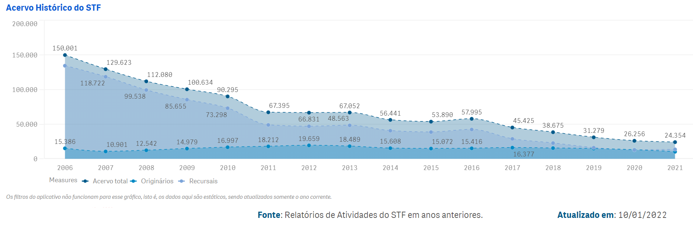

# <mark>Acervo</mark> {#acervo}

Os processos em tramitação no STF também são chamados de acervo. Nele estão computados todos os processos que tiveram andamento de entrada e ainda não foram baixados.

## Processos em tramitação (acervo)

O acervo processual do Tribunal corresponde ao quantitativo de processos em tramitação (excluindo-se os sigilosos) em determinada data. Computa-se, portanto, tudo que a Corte recebeu ([veja mais aqui](#recebimento)), excetuados os processos que já baixaram às origens ou arquivados no Tribunal ([veja mais aqui](#baixados)). 


### Andamentos que colocam um processo em trâmite

<mark>[Tabela]</mark>

### Andamentos que retiram um processo de trâmite

<mark>[Tabela]</mark>

A cada processo é designado um relator. Considera-se o **Ministro Relator Atual** o relator do último recurso, sendo feita a devida alteração quando há incidente de fato. Veja detalhes <mark>aqui</mark>.
Há feitos que são registrados ao Ministro Presidente, por determinação regimental, em razão do cargo. Quando o Ministro assume a Presidência, seus processos tornam-se o acervo do Ministro que deixou a Presidência. No entanto, continuam sob relatoria do novo Presidente aqueles processos que, até a data da assunção ao cargo, tenham sido, por ele, incluídos em pauta. Também continuam sob sua relatoria os processos que, à época de sua assunção na Presidência, eram objeto de pedido de vista por parte de outros Ministros.
Há processos que já tiveram decisão final mas permanecem em tramitação porque ainda aguardam o julgamento de recurso interno (agravo regimental, embargos de declaração ou embargos de divergência) ou a realização de providências complementares como a contagem de prazo, a realização de comunicações processuais e a publicação de acórdão.


### Histórico do acervo

No site podemos consultar o histórico dos processos em tramitação através do link <mark>"ACERVO 2020"</mark>.

```{r echo=FALSE, out.width = '100%', dpi = 300}
knitr::include_graphics("_bookdown_files/_main_files/figure-html/fig-cap4-1.png")
```


Será aberto um painel com os dados registrados nos relatórios de atividades de anos anteriores ([link](https://transparencia.stf.jus.br/single/?appid=e554950b-d244-487b-991d-abcc693bfa7c&sheet=ea8942c2-79fa-494f-bf18-ca6d5a3bfb43&theme=simplicity&opt=currsel&select=clearall)):

```{r echo=FALSE, out.width = '100%', dpi = 300}

```

Detalhamento do acervo pode ser obtido através do painel de acervo.

## Painel do acervo

<mark>Tópico pendente!</mark>

## Entenda o acervo

### Conceitos do acervo

#### Acervo processual

O acervo processual do Tribunal é composto pelos processos que se encontram em tramitação em determinada data. Computa-se, portanto, tudo que a Corte recebeu, excetuados os processos que já baixaram.
 Há processos que já tiveram decisão final mas permanecem em tramitação porque ainda aguardam o julgamento de recurso interno (agravo regimental, embargos de declaração, embargos infringentes ou embargos de divergência) ou a realização de providências complementares como a contagem de prazo, a realização de comunicações processuais e a publicação de acórdão.

##### Acervo processual de cada Ministro

O acervo processual de cada Ministro é composto pelos processos que recebeu do Ministro cuja vaga ocupou e por aqueles distribuídos após sua posse.
Tem-se, portanto, que cada Ministro inicia seu exercício no Tribunal com um acervo processual distinto, composto por processos de diferentes idades e que se encontram em diversas fases de tramitação. A distribuição de processos para um Ministro é interrompida logo após a vacância do cargo e é retomada com a posse do Ministro que ocupará sua vaga. Após a posse do novo Ministro, inicia-se um procedimento de compensação do quantitativo de processos que deixou de receber durante o período da vacância do cargo, salvo se o dispensar o Tribunal (art. 67, § 1° do Regimento Interno do STF).

##### Localização dos processos

Os processos em tramitação podem estar localizados no gabinete do Relator, no gabinete de outros Ministros, em outros setores ou mesmo fora do Tribunal. Alguns conceitos utilizados, descreve-se abaixo:
 
##### Localizados no gabinete do Relator

No gabinete dos respectivos relatores, encontram-se os feitos (i) que aguardam julgamento de mérito;  que já tiveram julgamento de mérito, mas que aguardam apreciação de recurso interposto por alguma das partes (agravo regimental, embargos de declaração, embargos de divergência, embargos infringentes e embargos à execução); e (iii) que já tiveram julgamento de mérito, não tiveram interposição de recurso, mas aguardam, no gabinete, a realização de providências complementares, como a liberação de decisão ou acórdão para publicação ou a apreciação de algum pedido incidental.
 É importante notar que nem todos os processos localizados nos gabinetes e que têm o mérito pendente estão prontos para julgamento. A título exemplificativo, há processos que tiveram, na petição inicial, (i) pedido de liminar ou tutela antecipada; que (ii) necessitam de contrarrazões ou da solicitação de informações a outros órgãos; ou (iii) que pendem de manifestação da Procuradoria-Geral da República, dentre outras providências.
 
 
##### Localizados no gabinete de outros Ministros

Um processo é remetido ao gabinete de Ministro que não seja seu relator quando:

- há pedido de vista; para revisão de ações penais e ações rescisórias; 
- para redação do acórdão, se o Relator for vencido; e 
- para deliberação sobre medida urgente nos períodos de recesso e férias e em casos de vacância, licença ou ausência do Relator, nas hipóteses regimentais.

##### Procuradoria-Geral da República

Os processos são remetidos à PGR para manifestação, como custus legis, ou para intimação, nos casos em que é parte.

##### Advogados, órgãos externos e setores internos

Os processos podem estar localizados (i) em outros setores do Tribunal, para juntada de petições, publicação de decisões, composição de acórdão, realização de comunicações processuais, realização de diligências, aguardando decurso de prazo, sobrestados, etc.; (ii) em órgãos externos; (iii) com os advogados das partes; ou (iv) em outro juízo ou Tribunal, para a realização de diligências.

#### Situação dos processos

##### Sem decisão final 

Os processos sem decisão final podem se encaixar nas seguintes situações:

- Em instrução (sem decisão);
- Com alguma decisão, exceto decisão final;
- Com decisão final;
- Com recurso interno pendente;
- Sem recurso interno pendente.

##### Em instrução (sem decisão)

Há processos que exigem, antes da tomada de qualquer decisão, informações complementares ou a manifestação da Procuradoria-Geral da República ou da Advocacia-Geral da União. Essas providências são determinadas pelo Relator por meio de despacho.
 
Ainda que os despachos sejam irrecorríveis, pode ocorrer de uma das partes interpor recurso interno (agravo regimental, embargos de declaração, embargos infringentes ou embargos de divergência). Nesse caso, o processo será concluso ao Relator para que o recurso seja apreciado e julgado.

##### Com alguma decisão, exceto decisão final

O julgamento do processo é identificado pela decisão final, mas cada feito pode ter mais de uma decisão. As decisões podem ser monocráticas ou colegiadas e são classificadas, no STF, em:

<ol>
<li>decisões liminares; </li>
<li>decisões interlocutórias; </li>
<li>decisões de sobrestamento^[Sobrestamento: é a suspensão do trâmite processual até o implemento de determinada condição.]; </li>
<li>decisões finais; </li>
<li>decisões de repercussão geral; e </li>
<li>decisões em recurso interno (agravo regimental, embargos de declaração, embargos infringentes e embargos de divergência). </li>
</ol>

Decisões liminares e decisões de sobrestamento, ainda que interlocutórias, receberam, no Tribunal, classificação própria, para fins estatísticos. 

Essas decisões são publicadas e, se for o caso, devem também ser objeto de comunicação.

**Com decisão final**

A decisão final é a principal decisão do processo. Ainda que possam ser utilizados, como sinônimos para decisão final, decisão de mérito ou julgamento de mérito, é possível que a decisão final não chegue a efetivamente apreciar o mérito da causa. Noutras palavras, são consideradas decisões finais também as decisões de não conhecimento, de prejudicialidade, de homologação de desistência e de negativa de seguimento.
 
**Com recurso interno pendente**

 Se for apresentado recurso interno, o processo será encaminhado ao Relator para apreciação.
 São recursos internos o agravo regimental, os embargos de declaração, os embargos infringentes e os embargos de divergência.
As partes podem interpor recurso de qualquer decisão e o Tribunal deverá apreciá-lo mesmo que se trate de decisão irrecorrível.

**Sem recurso interno pendente**

 Após a decisão final, são necessárias providências complementares, como a publicação da decisão ou acórdão, a expedição de comunicações e a contagem do prazo processual.  
 Se não houver recurso, ocorrerá o trânsito em julgado da decisão e, subsequentemente, a baixa do processo ao arquivo ou à origem. 

### Regra de relatoria do processo

O acervo divulgado do Ministro no Portal do STF utiliza como critério o filtro do campo “Relator Atual” do Portal de Informações Gerenciais. Ao chegar no Tribunal, o processo é sorteado para o relator do mérito que será alocado inicialmente como “Relator Atual”. 
Ou seja, o processo constará no acervo de determinado Ministro, quando o processo for distribuído para o Ministro:

```{r echo=FALSE, warning=FALSE}
cap4_1 <- readxl::read_excel("dados/cap4.xlsx", sheet = "acervo_4-1")

cap4_1 |> 
kableExtra::kable()
```
<br>

**Regra geral**

```{r echo=FALSE, out.width = '100%', fig.cap="Fluxo simplificado da substituição de relatoria para os casos do  art. 38, II, do RISTF.", dpi = 300, display="cite"}
knitr::include_graphics("_bookdown_files/_main_files/figure-html/fig-cap4-3.png")
```


Casos de substituição de relatoria para efeitos de acervo:

- Se o processo receber os andamentos 7508 - substituição nos casos, por exemplo, de aposentadoria, renúncia ou morte ou o andamento 7505 -  redistribuição posteriores à distribuição, passará a constar no acervo de um novo ministro.
- Se o processo receber o andamento 8509 - Substituição do Relator, art. 38, II, do RISTF, em que o relator, quando vencido no julgamento, é substituído pelo Ministro designado para lavrar o acórdão, o processo permanece no acervo do Ministro Relator até que haja algum incidente. Recebido o incidente, o campo “Relator atual” passa a ser preenchido com o nome do relator do último incidente, alterando o acervo deste. 
A **substituição de relatoria** é a troca de um relator por outro Ministro previamente determinado em normativo. Ela se diferencia da redistribuição porque se sabe exatamente para qual novo Ministro a relatoria do processo deverá ser atribuída.
	No caso da substituição do relator vencido no julgamento, o registro de redator para o acórdão é lançado no sistema textual pela equipe do Plenário/Turmas. Em termos quantitativos, devido à regra de sistema, este registro não impacta o acervo dos ministros. Como mencionado, o acervo do ministro só será impactado após o recebimento do incidente.  Nos casos em que o relator é vencido,  ao ingressar uma petição no STF, cada caso será analisado individualmente para verificar para quem será o registro. Se a petição tiver relação com o acórdão, normalmente, deve ser registrada para o redator do acórdão. 


<!-- Reference items in your bibliography file(s) using `@key`. -->

<!-- For example, we are using the **bookdown** package [@R-bookdown] (check out the last code chunk in index.Rmd to see how this citation key was added) in this sample book, which was built on top of R Markdown and **knitr** [@xie2015] (this citation was added manually in an external file book.bib).  -->
<!-- Note that the `.bib` files need to be listed in the index.Rmd with the YAML `bibliography` key. -->


<!-- The RStudio Visual Markdown Editor can also make it easier to insert citations: <https://rstudio.github.io/visual-markdown-editing/#/citations> -->
