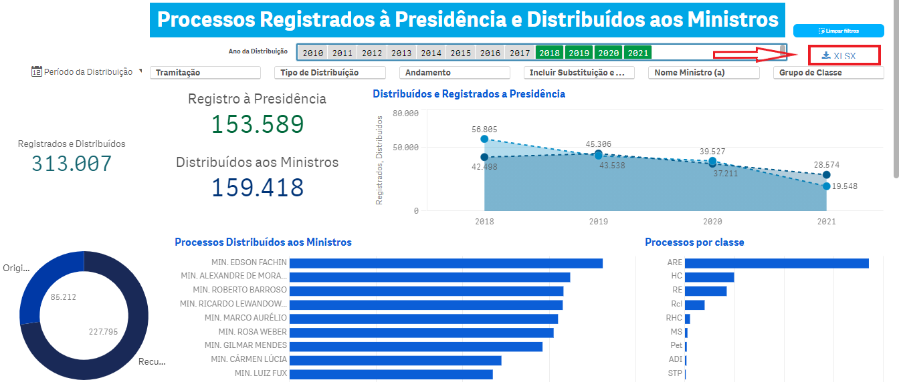
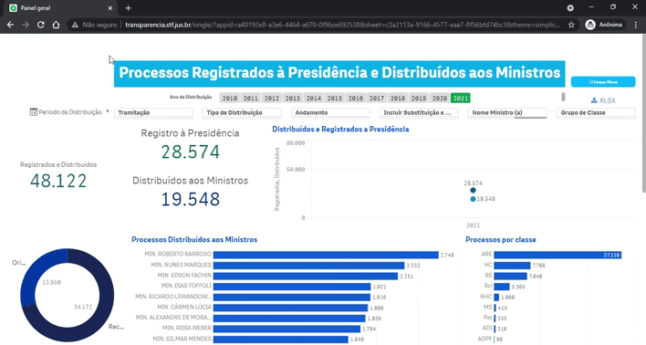
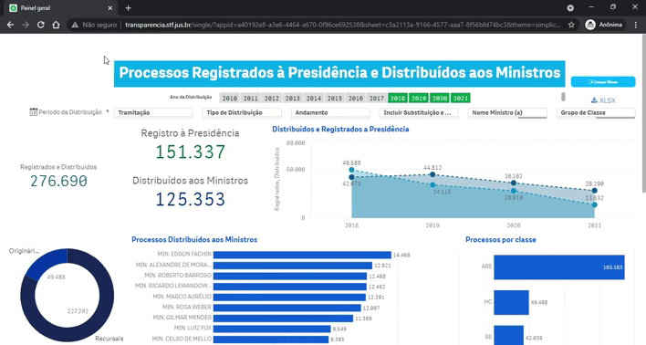

# <mark>Registro e Distribuição</mark> {#registro-distribuicao}

> Registro à Presidência e distribuição aos ministros

Do total de processos recebidos, alguns têm o seguimento obstado pela Presidência, por atribuição regimental (arts. 13, V, c e d; 327, caput; e 328, parágrafo único, do RISTF): recursos que não preenchem requisitos formais de admissibilidade; que tratam de temas com repercussão geral já apreciada pelo STF; prejudicados em razão de decisão do STJ em recurso especial ou agravo interposto no mesmo processo. 

Outros são registrados ao presidente, porque só a ele competem (arts. 13, V, d, e XV; 70, § 4º; 278; 297; 351; e 354-A do RISTF): habeas corpus em que seja manifesta a incompetência do Tribunal para a apreciação do pedido e feitos das classes Arguição de Suspeição (AS), Intervenção Federal (IF), Proposta de Súmula Vinculante (PSV), Suspensão de Liminar (SL), Suspensão de Segurança (SS) e Suspensão de Tutela Antecipada (STA) — esta desde dezembro de 2017 denominada Suspensão de Tutela Provisória (STP). 

**Os processos que não se enquadram nas hipóteses anteriores são distribuídos livremente ou por prevenção aos ministros, excetuado o presidente.**

Em relação às estatísticas, a soma dos processos distribuídos e registrados à Presidência não coincide com o total de processos recebidos. Essa diferença corresponde às seguintes situações: 

1. processos recebidos mas ainda não distribuídos ou registrados; 

1. retificações de autuações (processos repetidos — duplicados, triplicados etc. —, cujas cópias são baixadas à origem);

1. inconformidades para tramitação, como por exemplo, processos indevidamente remetidos ao STF, processos sem peças suficientes para a autuação ou remetidos mais de uma vez ao Tribunal;

1. situações em que o mesmo processo pode ter sido registrado à presidência e posteriormente distribuído.

<br>

**Grupo de andamento Distribuição**

```{r echo=FALSE, warning=FALSE}
cap6_1 <- readxl::read_excel("dados/cap6.xlsx", sheet = "acervo_6-1")
cap6_1 |> 
kableExtra::kable()
```

## Painel de distribuição aos Ministros e Registrado à Presidência

Do total de processos recebidos, alguns são registrados à Presidência por atribuição regimental e outros são distribuídos aos ministros.

```{r echo=FALSE, out.width = '100%', dpi = 300}
knitr::include_graphics("imagens/fig-cap6-1.png")
```

<br>

**Taxonomia do Painel**

O painel de Registrados à Presidência e Distribuídos aos Ministros possui 8 filtros, além da disponibilidade de utilizar gráficos e tabelas para outras seleções.


| Dimensão | Definição |
|---------- |:--------- |
| Período da Distribuição |	Seleciona um período entre datas específicas. |
| Ano da Distribuição	| Filtra o ano em que o processo foi distribuído. |
| Tramitação |	Dos processos que foram distribuídos mostra aqueles que ainda estão em tramitação ou não |
| Tipo de distribuição |	Classifica se o processo foi distribuído para o Ministro Presidente ou demais Ministros |
| Andamento |	Esse filtro mostra em quais Subgrupos estão divididas as distribuições |
| Incluir Substituição e/ou Redistribuição | Inclui no painel aqueles casos que tiveram a Substituição e/ou Redistribuição de um relator por outro Ministro |
| Nome Ministro(a) | Ministro que foi registrado na distribuição. Nesse filtro, ao selecionar um Ministro, será selecionado a quantidades de processos Distribuídos aos Ministros e/ou Registrados à Presidência.|
| **Grupo de Classe** | As classes foram agrupadas em quatro subgrupos, conforme abaixo: <br><br>**1. Controle Concentrado:** <br> 1. Processos das classes Ação Declaratória de Constitucionalidade (ADC);<br>2. Ação Direta de Inconstitucionalidade (ADI);<br>3. Ação Direta de Inconstitucionalidade por Omissão (ADO); <br> 4. Arguição de Descumprimento de Preceito Fundamental (ADPF). <br><br> **2.Criminais:** <br> 1. Processos das classes Ação Penal (AP); <br> 2. Execução de Pena (EP); <br>3. Extensão (Ext); <br>4. Habeas Corpus (HC); <br>5. Inquérito (Inq); <br>6. Prisão Preventiva para Extradição (PPE); <br>7. Recurso Crime (RC); <br>8. Recurso em Habeas Corpus (RHC); e <br>9. Revisão Criminal (RvC). <br><br>**3. Recursais:** <br> 1. Recurso extraordinário (RE); <br> 2. Recurso extraordinário com agravo (ARE); e  <br>3. Agravo de instrumento (AI). <br><br> **4. Demais originárias:**<br> Todas as classes originárias, exceto controle concentrado e criminais.  |

<br>

**Dados Abertos**

O painel permite que os dados sejam baixados num link no canto superior direito:

```{r echo=FALSE, out.width = '100%', dpi = 300}

```

<br>

As variáveis possíveis de serem consultados pelo XLSX:

```{r echo=FALSE, warning=FALSE}
cap6_2 <- readxl::read_excel("dados/cap6.xlsx", sheet = "acervo_6-2")
cap6_2 |> 
kableExtra::kable()
```
<br>

**Tutoriais do Painel**

```{r echo=FALSE, warning=FALSE}
cap6_3 <- readxl::read_excel("dados/cap6.xlsx", sheet = "acervo_6-3")
cap6_3 |> 
kableExtra::kable()
```
<br>

De modo geral, para filtrar algum gráfico ou tabela selecione um ou mais valores e depois confirme o filtro no botão verde conforme indicado na imagem abaixo:

```{r echo=FALSE, out.width = '100%', dpi = 300}

```

<br>

Para limpar os filtros de todo o painel basta clicar no botão "limpar filtros" no canto superior direito:

```{r echo=FALSE, out.width = '100%', dpi = 300}

```

<br>

Segue abaixo uma visão geral do painel, filtros, tabelas e gráficos:

```{r echo=FALSE, out.width = '100%', dpi = 300}
knitr::include_graphics("imagens/fig-cap6-5.gif")
```

