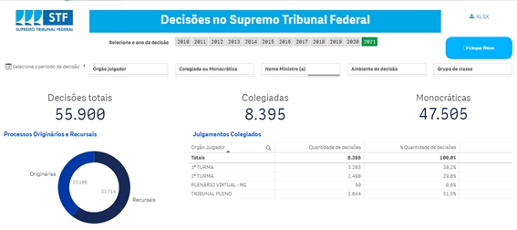
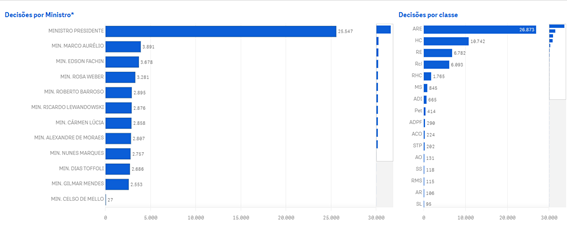
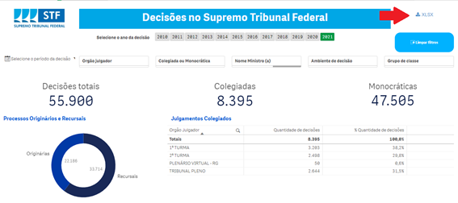

# Decisões

## Decisão

Os atos processuais do magistrado podem ser divididos em dois grupos: despachos e decisões. Nos Tribunais as decisões devem, em regra, ser proferidas de forma colegiada.

Os Ministros, no entanto, tem competência legal e regimental para, em hipóteses determinadas, proferir decisões de forma monocrática, ou seja, individualmente, sem levar ao órgão colegiado (Plenário, Plenário Virtual e Turmas).

As decisões colegiadas dos Tribunais são denominadas acórdãos. O julgamento é o ato de decidir o processo e o acórdão é o documento escrito, composto pelo relatório e pelos votos de todos os Ministros que tenham participado do julgamento, que é efetivamente juntado ao processo.
 
## Despacho 

Os despachos são atos do magistrado que servem para dar impulso ao processo (ex.: pedido de informações a autoridades ou a outros juízos, encaminhamento à PGR para parecer, determinação de citação, intimação ou outras diligências) e não são recorríveis.

## Acórdão

Os julgamentos dos órgãos colegiados são realizados oralmente, de forma que os votos proferidos por cada magistrado devem ser reduzidos a termo para que sejam publicados e juntados ao processo. Essa circunstância leva à ocorrência, nos Tribunais, de uma separação temporal entre o momento do julgamento e o momento da composição do acordão.

A extensão desse lapso não está relacionada, necessariamente, à extensão dos votos. São compostos mais rapidamente os acórdãos formados por votos que os Ministros já tenham levado escritos para a sessão de julgamento. É mais lenta, por sua vez, a composição daqueles que exijam a transcrição da sessão de julgamento, porque o texto resultante deve ser revisto e aprovado pelos Ministros. 

Nos relatórios estatísticos, as decisões colegiadas equivalem ao julgamento em sessão colegiada, independentemente do tempo que se leve para compor e publicar o acórdão.

## Julgamento nos órgãos colegiados

Os processos instruídos pelo Relator são liberados para julgamento, por meio de inclusão do feito em pauta ou apresentação em mesa, nas hipóteses regimentais (independe de inclusão em pauta o julgamento de habeas corpus, mandados de segurança e recursos internos(colocar link depois)).

Compete ao Presidente do órgão colegiado em que ocorrerá o julgamento selecionar, dentre os processos liberados, aqueles que serão julgados na sessão. Habeas corpus e mandados de segurança têm preferência sobre as demais classes na pauta de julgamento.

Após a leitura do voto pelo Relator, o Presidente do órgão concede a palavra aos advogados que farão sustentação oral, se houver, e, posteriormente, ao Procurador-Geral da República, nas causas em que deva se manifestar.

Proferido o voto do Relator, passa-se à votação do colegiado, que seguirá a ordem crescente de antiguidade no Tribunal.

## Pedido de vista 
Qualquer Ministro, excetuando-se o Relator, pode pedir vista dos autos, para melhor análise da demanda. É possível que tal pedido ocorra a qualquer momento, independentemente da ordem de votação. 

O julgamento é suspenso até posterior liberação dos autos pelo Ministro que formulou o pedido e chamamento do feito, pelo Presidente do colegiado, em nova sessão.

## Painel de Decisões
O objetivo é apresentar as principais funcionalidades do painel de decisões do STF, disponível neste [link](https://transparencia.stf.jus.br/single/?appid=1f9aa2cf-d569-4e98-bd2a-a9dac4e79a69&sheet=3490ef1f-f90e-4b51-9b93-b578efd54efd&theme=simplicity&opt=currsel&select=clearall)

```{r, echo=FALSE, out.width="80%",out.height="95%",fig.show='hold', fig.align='center'}


```

Trata-se de um painel desenvolvido no âmbito do projeto institucional de Transparência de Dados, que possibilita ao cidadão obter informações variadas sobre decisões, em diversas naturezas de filtro. A tecnologia principal utilizada para confecção do painel (QlikSense) permite conexão direta com a base de dados, de forma que regras para a atualização do painel foram definidas a priori. Atualmente, as informações são atualizadas no seguinte intervalo:

## Taxonomia do Painel 
O painel de decisões possui 7 filtros básicos, cujas combinações permitem a extração de informações sobre o período de decisão, orgão julgador e grupo de classe, dentre outras opções. Os filtros serão melhor explicados na sequência. Abaixo temos um exemplo de filtro:

```{r, echo=FALSE, out.width="80%",out.height="95%",fig.show='hold', fig.align='center'}


```

O painel de acervo possui 6 filtros, além da possibilidade de utilizar gráficos e tabelas para outras seleções. 
As dimensões dos filtros utilizados no painel são descritas abaixo:

| Dimensão | Definição |
| :----------| :---------|
| **Grupo Classe** | As classes foram agrupadas em quatro subgrupos, conforme abaixo:<br>**1. Controle Concentrado:**<br> 1. Processos das classes Ação Declaratória de Constitucionalidade (ADC); <br> 2. Ação Direta de Inconstitucionalidade (ADI); <br> 3. Ação Direta de Inconstitucionalidade por Omissão (ADO); <br>4. Arguição de Descumprimento de Preceito Fundamental (ADPF). <br>**2. Criminais:**<br> 1.Processos das classes Ação Penal (AP); <br> 2.Execução de Pena (EP); <br> 3.Extensão (Ext); <br> 4.Habeas Corpus (HC); <br> 5.Inquérito (Inq); <br> 6.Prisão Preventiva para Extradição (PPE);<br> 7.Recurso Crime (RC); <br> 8.Recurso em Habeas Corpus (RHC); e <br> 9.Revisão Criminal (RvC).<br>**3. Recursais:** <br> 1.Recurso extraordinário (RE);<br> 2.Recurso extraordinário com agravo (ARE); e <br> 3.Agravo de instrumento (AI). <br>**4. Demais originárias:** Todas as classes originárias, exceto controle concentrado e criminais.|
| **Nome Ministro(a)** | Neste filtro, ao selecionar um ministro, serão selecionadas as decisões proferidas. Os itens deste filtro são os nomes dos ministros atuais e já aposentados da corte. | 
|**Ambiente de decisão** | Filtro para separar decisões proferidas em ambientes virtuais ou presenciais.| 
|**Colegiada ou Monocrática**|Filtro para separar decisões monocráticas e decisões tomadas em turmas ou no plenário.Se a distinção entre as decisões colegiadas for necessária – isto é, decisões em turmas ou em plenário – basta utilizar o filtro que segue.|
|**Orgão Julgador**|Generalização do filtro anterior. É possível escolher entre decisões monocráticas, em turmas ou em plenário.|
|**Período de decisão**|Filtro útil para selecionar intervalos específicos de tempo. Granular em dias, permite também a seleção por mês atual, mês anterior, últimos 7 dias ou em um intervalo definido por duas datas quaisquer.|

Os dados gerados a partir dos filtros podem ser baixados através do botão destacado na figura abaixo, em formato xlsx.

```{r, echo=FALSE, out.width="80%",out.height="95%",fig.show='hold', fig.align='center'}


```

As colunas do arquivo gerado são as seguintes:

**1) Processo** - Classe e número do processo

**2) Nome Ministro** – Nome do Ministro responsável pela decisão. 

**3) Tipo Decisão** – Monocrática ou Colegiada. 

**4) Ambiente de Decisão** – Virtual, Presencial ou Não se Aplica. 

**5) Orgão Julgador** – Igual ao Nome Ministro, no caso de decisões monocráticas. Para decisões colegiadas, retorna a turma ou o plenário.

**6) Andamento** – Descrição do andamento da decisão. 

**7) Data Andamento** – Data de registro do andamento.

**8) Subgrupo Andamento** – Seguintes categorias: Decisão Final, Decisão Interlocutória, Decisão em Recurso Interno, Decisão de Sobrestamento, Decisão Liminar e Decisão de Repercussão Geral.

**9) Observação do Andamento** – Texto livre que funciona como um resumo sobre a decisão.

**10) Ocorrências Processuais** – Variável numérica que conta o número de vezes que um determinado processo teve decisões associadas. A análise desta variável é importante para que as quantidades, de fato, sejam as mesmas apresentadas no painel. Em resumo, no arquivo são retiradas as duplicidades que são observadas em painel.
